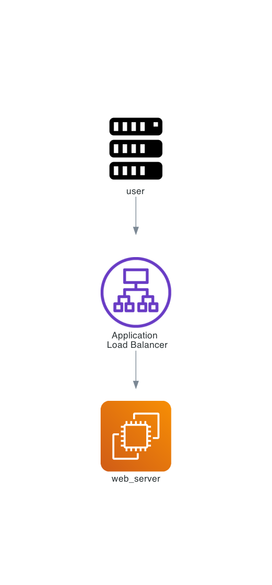
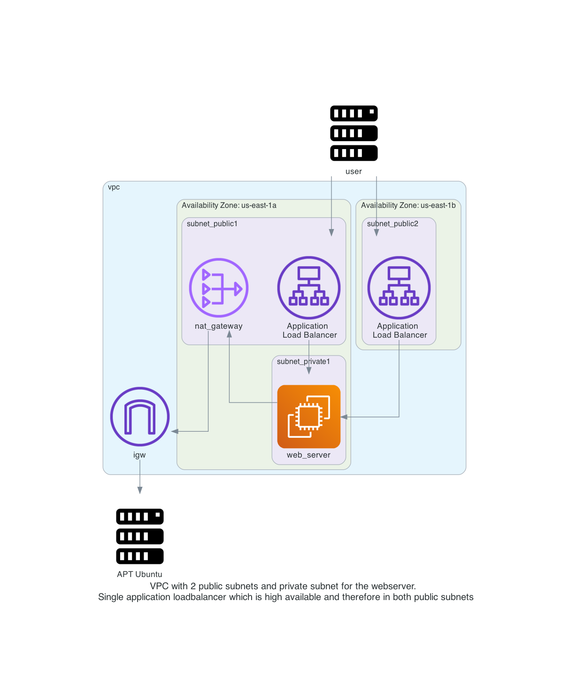

# AWS Loadbalancer with nginx webserver

In this repository you will deploy a webserver behind an application load balancer with Terraform on AWS. 

Steps involved are: 
- Create a VPC with subnets, routing tables, internet gateway and nat gateway
- Creating an EC2 instance with Ubuntu in a private subnet with no public ip address
- Creating a Security group that allows traffic over port 80 to the loadbalancer and webserver
- Create an application load balancer to forward http traffic to the web server in the private subnet

Diagram of the environment:    
Simple:  
    

Detailed:  
     

Wardley Map drawing:  
   

There is a short [README.md](manual_steps/README.md) on how to do all this manually without Terraform. This is just to give you a better idea on the steps involved. Please use this only if you do not want to use Terraform. 

# Prerequisites

## AWS
We will be using AWS. Make sure you have the following
- AWS account  
- Install AWS cli [See documentation](https://docs.aws.amazon.com/cli/latest/userguide/install-cliv2.html)

## Install terraform  
See the following documentation [How to install Terraform](https://learn.hashicorp.com/tutorials/terraform/install-cli)

# How to

- Clone the repository to your local machine
```
git clone https://github.com/munnep/aws_loadbalancer_nginx.git
```
- Go to the directory
```
cd aws_loadbalancer_nginx
```
- change the values in the ```variables.tf``` to mach your environment
- Set your AWS credentials
```
export AWS_ACCESS_KEY_ID=
export AWS_SECRET_ACCESS_KEY=
export AWS_SESSION_TOKEN=
```
- Terraform initialize
```
terraform init
```
- Terraform plan
```
terraform plan
```
- Terraform apply
```
terraform apply
```
- Terraform output should create 20 resources and show you the public dns string you can use to connect to the webserver
```
Apply complete! Resources: 20 added, 0 changed, 0 destroyed.

Outputs:

http_link = "http://patrick-lb-1524684924.eu-central-1.elb.amazonaws.com"
```
- You should be able to connect to the http_link with your web browser and see the nginx default webpage

# done
- [x] create VPC
- [x] create 2 subnets, one for public network, one for private network
- [x] create internet gw and connect to public network with a route table
- [x] create nat gateway, and connect to private network with a route table
- [x] route table association with the subnets 
- [x] security group for allowing port 80
- [x] create ec2 instance without public ip, only private subnet
- [x] create a LB (check Application Load Balancer or Network Load Balancer)
- [x] publish a service over LB, ie nginx

# to do

